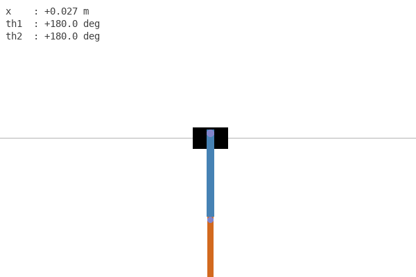
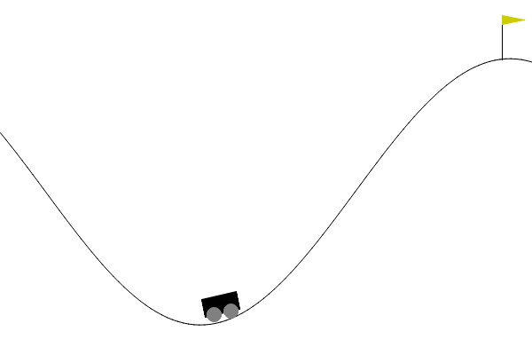
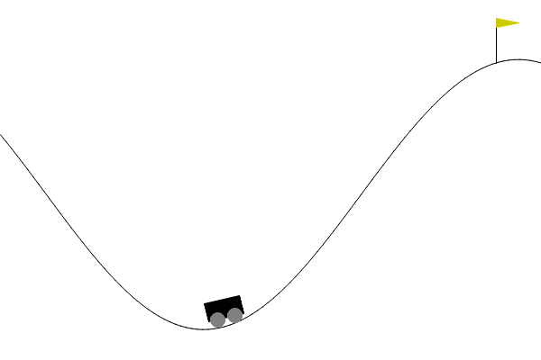
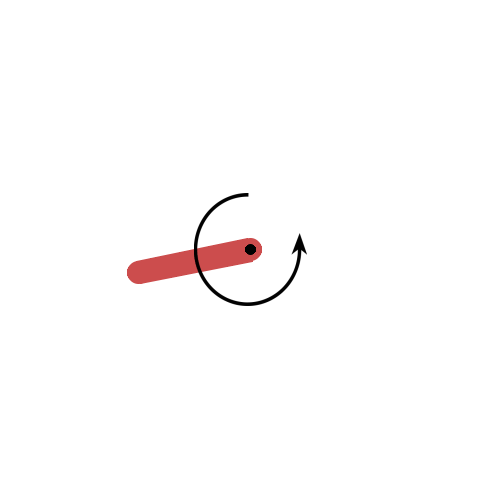
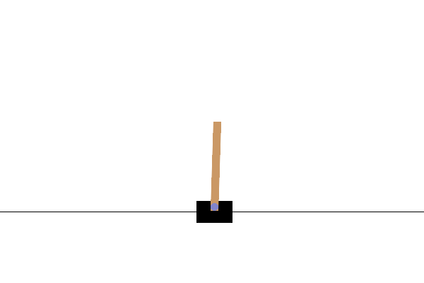
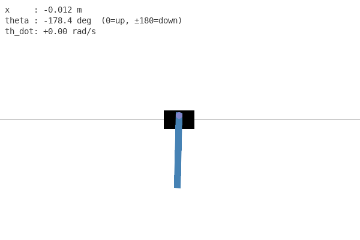
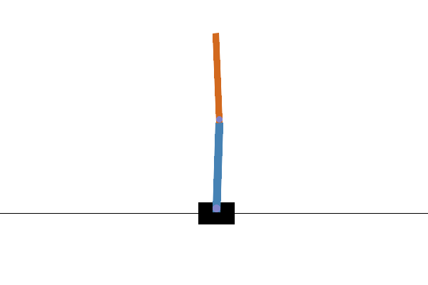

# CUDA Policy Iteration — Continuous RL via Dynamic Programming

Solve continuous-state, continuous-action control problems with GPU-accelerated Policy Iteration.  
The implementation is based on the theoretical framework described in **[Continuous RL via Dynamic Programming](continuous_RL.pdf)**, which rigorously bridges the gap between continuous physics (Hamilton-Jacobi-Bellman equations) and discrete computation (Markov Decision Processes).

---

## Table of Contents

1. [Setup](#setup) — [Quick path: Docker](#quick-path-docker) or [Native install](#native-install-alternative)
2. [Project Structure](#project-structure)
3. [Running the Runners](#running-the-runners)
4. [CLI Reference](#cli-reference)
5. [Environments](#environments)
6. [Extending with a New Environment](#extending-with-a-new-environment)
7. [Autoresearch — autonomous reward-shaping search](#autoresearch--autonomous-reward-shaping-search)
8. [Theoretical Background](#theoretical-background)

---

## Setup

### Quick path: Docker

If you want a one-shot deploy on a different machine — including older Ubuntu hosts where installing the right CUDA + Python combination by hand is painful — use the included `Dockerfile` and `docker-compose.yml`.

The image bundles:
- CUDA **12.2.2** runtime (broadly compatible with NVIDIA driver ≥ 525 — see [version matrix](#cuda-version-matrix) below for older drivers)
- Python 3.10 + cupy + numba + numpy + matplotlib + gymnasium + pygame + loguru
- SDL2 + ffmpeg for rendering and `.gif`/`.mp4` recording
- Xvfb for headless rendering (so `--record` works on a server without an X server)

#### Host prerequisites (one-time)

**1. NVIDIA driver**
```bash
nvidia-smi    # must succeed and show your GPU
```
The `CUDA Version: X.Y` line in `nvidia-smi` is the **maximum** CUDA the driver supports. The container's CUDA must be **≤ that value** (consumer GPUs do not support forward compatibility).

**2. Docker Engine 20.10+**
```bash
curl -fsSL https://get.docker.com | sudo sh
sudo usermod -aG docker $USER
# Log out and back in so the docker group takes effect.
```

**3. NVIDIA Container Toolkit** — exposes the host GPU to containers
```bash
distribution=$(. /etc/os-release; echo $ID$VERSION_ID)
curl -fsSL https://nvidia.github.io/libnvidia-container/gpgkey \
    | sudo gpg --dearmor -o /usr/share/keyrings/nvidia-container-toolkit-keyring.gpg
curl -fsSL https://nvidia.github.io/libnvidia-container/stable/deb/nvidia-container-toolkit.list \
    | sed 's#deb https://#deb [signed-by=/usr/share/keyrings/nvidia-container-toolkit-keyring.gpg] https://#g' \
    | sudo tee /etc/apt/sources.list.d/nvidia-container-toolkit.list
sudo apt update && sudo apt install -y nvidia-container-toolkit
sudo nvidia-ctk runtime configure --runtime=docker
sudo systemctl restart docker
```

**4. Smoke test the host setup**
```bash
docker run --rm --gpus all nvidia/cuda:12.2.2-base-ubuntu22.04 nvidia-smi
```
If you see your GPU table, the host is ready.

#### Build the project image

```bash
cd DynamicProgramming
docker compose build         # ~10-15 min the first time
```

Subsequent builds (after editing source code only, not `requirements.txt`) finish in ~30 sec thanks to Docker's layer cache.

#### Run a runner

The compose service is named `pi`. Anything passed after `pi` becomes the command inside the container.

```bash
# Hello world — list available runners
docker compose run --rm pi

# Random baseline (no training)
docker compose run --rm pi python3 runners/pendulum_cuda.py --random 5

# Train + evaluate (Pendulum, ~30 sec on RTX 3090)
docker compose run --rm pi python3 runners/pendulum_cuda.py --bins 200

# Train + evaluate (Double Pendulum 4D, ~5 min on RTX 3090)
docker compose run --rm pi python3 runners/double_pendulum_swingup_cuda.py --bins 25

# Headless GIF recording — no X server needed thanks to Xvfb
docker compose run --rm pi xvfb-run -a \
    python3 runners/double_pendulum_swingup_cuda.py \
            --record gifs/pendulum_doble.gif --episodes 3 --no-plot --bins 50

# Drop into an interactive shell inside the container
docker compose run --rm pi bash
```

The compose file mounts `./results`, `./gifs`, and `./trials` as volumes, so trained policies, recordings, and autoresearch trials persist on the host between runs.

#### Live `--render` window (X11 forwarding)

```bash
xhost +local:docker
docker compose run --rm \
    -e DISPLAY=$DISPLAY \
    -e SDL_VIDEODRIVER=x11 \
    -v /tmp/.X11-unix:/tmp/.X11-unix \
    pi \
    python3 runners/cartpole_cuda.py --render
```

#### CUDA version matrix

The container's CUDA stack must be ≤ the CUDA version the host driver supports. Match build args to your driver:

| `nvidia-smi` reports | host driver | container `CUDA_VERSION` | `CUPY_PACKAGE` |
|---|---|---|---|
| CUDA 12.2 / 12.3 / 12.4 | ≥ 525 | `12.2.2` *(default)* | `cupy-cuda12x` |
| CUDA 12.0 / 12.1 | 525–530 | `12.0.1` | `cupy-cuda12x` |
| CUDA 11.7 / 11.8 | 470–525 | `11.8.0` | `cupy-cuda11x` |
| CUDA 11.4 / 11.6 | 460–470 | `11.4.3` | `cupy-cuda11x` |

To override, edit `docker-compose.yml`:
```yaml
args:
  CUDA_VERSION: 11.8.0
  CUPY_PACKAGE: cupy-cuda11x
```
…then `docker compose build --no-cache`.

#### Plain `docker run` (without compose)

```bash
docker build -t cuda-pi .

docker run --rm --gpus all \
    -v "$PWD/results:/app/results" \
    -v "$PWD/gifs:/app/gifs" \
    -v "$PWD/trials:/app/trials" \
    cuda-pi \
    python3 runners/cartpole_cuda.py --random 5
```

#### Common errors

| symptom | cause | fix |
|---|---|---|
| `could not select device driver "" with capabilities: [[gpu]]` | NVIDIA Container Toolkit missing or Docker not restarted | redo step 3 of host setup, then `sudo systemctl restart docker` |
| `cudaErrorCompatNotSupportedOnDevice: forward compatibility was attempted on non supported HW` | container CUDA newer than host driver supports | rebuild with a smaller `CUDA_VERSION` (see matrix above) |
| `cupy.cuda.compiler.CompileException` | `cupy-cuda12x` installed but driver only supports CUDA 11.x | rebuild with `cupy-cuda11x` |
| `pygame.error: No available video device` | `--render` without an X server | use `xvfb-run -a python3 …` instead |

### Native install (alternative)

#### 1. Prerequisites

- **NVIDIA GPU** with CUDA Toolkit installed
- **Python 3.10+**
- `nvidia-smi` available in PATH

Check your CUDA version:

```bash
nvidia-smi | grep "CUDA Version"
# or
nvcc --version
```

#### 2. Create a Virtual Environment

```bash
python3 -m venv env
source env/bin/activate        # Linux / macOS
# env\Scripts\activate         # Windows
```

#### 3. Install CuPy — Match Your CUDA Version

> **Critical:** CuPy must match the CUDA Toolkit installed on your machine. Installing the wrong version will fail silently or raise `cupy.cuda.compiler.CompileException`.

| CUDA Version | Package |
|---|---|
| 11.x | `cupy-cuda11x` |
| 12.x | `cupy-cuda12x` |
| 13.x | `cupy-cuda13x` |

Edit `requirements.txt` to match your version, then install:

```bash
# Example for CUDA 12.x (default in requirements.txt)
pip install cupy-cuda12x

# Example for CUDA 11.x
pip install cupy-cuda11x
```

Verify CuPy can see your GPU:

```bash
python3 -c "import cupy; print(cupy.cuda.runtime.getDeviceCount(), 'GPU(s) detected')"
```

#### 4. Install All Dependencies

```bash
pip install -r requirements.txt
```

For MP4 video recording (optional):

```bash
pip install "imageio[ffmpeg]"
```

#### 5. Final Check

```bash
python3 -c "
import cupy, numba, numpy, gymnasium, matplotlib
print('cupy   :', cupy.__version__)
print('numba  :', numba.__version__)
print('numpy  :', numpy.__version__)
print('gym    :', gymnasium.__version__)
print('All OK')
"
```

---

## Project Structure

```
DynamicProgramming/
├── src/
│   └── cuda_policy_iteration.py   # Core engine: CudaPolicyIteration2D/4D/6D + CudaPIConfig
├── runners/
│   ├── cartpole_cuda.py                   # CartPole              (4D balance)
│   ├── cartpole_swingup_cuda.py           # CartPole              (4D swing-up)
│   ├── pendulum_cuda.py                   # Pendulum              (2D swing-up)
│   ├── mountain_car_cuda.py               # Mountain Car          (2D)
│   ├── continuous_mountain_car_cuda.py    # Continuous Mtn Car    (2D)
│   ├── double_pendulum_swingup_cuda.py    # Double Pendulum       (4D underactuated)
│   ├── double_cartpole_cuda.py            # Double CartPole       (6D balance)
│   ├── double_cartpole_swingup_cuda.py    # Double CartPole       (6D swing-up)
│   ├── hybrid_double_cartpole.py          # Hybrid DP + DP        (6D swing-up + balance)
│   └── overhead_crane_cuda.py             # Overhead Crane        (4D anti-sway)
├── utils/
│   └── barycentric.py             # Barycentric interpolation for policy inference
├── gifs/                          # Pre-recorded environment demos
├── results/                       # Saved policies (.npz) and plots
├── requirements.txt
├── Dockerfile                     # CUDA 12.x runtime + all deps (see Docker section)
├── docker-compose.yml             # Convenience wrapper for `docker compose run pi …`
├── .dockerignore
└── continuous_RL.pdf              # Theoretical foundation
```

Each runner subclasses the appropriate base class and implements a single method:

```python
def _dynamics_cuda_src(self) -> str:
    """Return a raw CUDA C string containing the step_dynamics() device function."""
```

The kernel is compiled at runtime via **NVRTC** — no pre-compilation step needed.

---

## Running the Runners

All runners follow the same workflow:

```
cd DynamicProgramming/

# First run: trains and saves policy, then evaluates
python3 runners/<runner>.py

# Subsequent runs: loads saved policy, skips training
python3 runners/<runner>.py

# Force retraining
python3 runners/<runner>.py --retrain

# Render live + record to GIF
python3 runners/<runner>.py --render --record gifs/<runner>.gif --episodes 3

# Quick random baseline (no training needed)
python3 runners/<runner>.py --random 5
```

### Generate All GIFs

```bash
python3 runners/cartpole_cuda.py                --record gifs/cartpole.gif                --episodes 3 --no-plot
python3 runners/cartpole_swingup_cuda.py        --record gifs/cartpole_swingup.gif        --episodes 3 --no-plot
python3 runners/pendulum_cuda.py                --record gifs/pendulum.gif                --episodes 3 --no-plot
python3 runners/mountain_car_cuda.py            --record gifs/mountain_car.gif            --episodes 3 --no-plot
python3 runners/continuous_mountain_car_cuda.py --record gifs/continuous_mountain_car.gif --episodes 3 --no-plot
python3 runners/double_pendulum_swingup_cuda.py --record gifs/pendulum_doble.gif          --episodes 3 --no-plot --bins 50
python3 runners/double_cartpole_cuda.py         --record gifs/double_cartpole.gif         --episodes 3 --no-plot
python3 runners/double_cartpole_swingup_cuda.py --record gifs/double_cartpole_swingup.gif --episodes 3 --no-plot
python3 runners/hybrid_double_cartpole.py       --record gifs/hybrid_double_cartpole.gif  --episodes 3
python3 runners/overhead_crane_cuda.py          --record gifs/overhead_crane.gif          --episodes 3 --no-plot
```

### Overhead Crane: Custom Target

```bash
# Transport from x=+2.5 m to x=-2.5 m (default)
python3 runners/overhead_crane_cuda.py --retrain --target-x -2.5 --start-x 2.5

# Transport to centre
python3 runners/overhead_crane_cuda.py --retrain --target-x 0.0 --start-x 2.5
```

---

## CLI Reference

**All runners share the exact same set of arguments.** This makes batch scripts portable across environments — change only the runner name and the rest of the command line stays the same.

| Argument | Default | Description |
|---|---|---|
| `--render` | off | Open a live pygame window during evaluation |
| `--record PATH` | off | Save evaluation video to `.gif` or `.mp4` (MP4 needs `imageio[ffmpeg]`) |
| `--random [N]` | off | Run N episodes with a random policy as baseline, no training (default N=5) |
| `--episodes N` | **5** | Number of evaluation episodes |
| `--steps N` | **1000** | Max steps per evaluation episode |
| `--bins N` | per-runner | Bins per state dimension — trades memory for resolution |
| `--seed N` | **42** | Random seed for episode resets |
| `--no-plot` | off | Skip saving value function / policy slice plots |
| `--retrain` | off | Force retraining even if a saved policy exists |
| `--save-path PATH` | `results/<runner>_policy.npz` | Where to save / load the policy `.npz` |

**Runner-specific arguments:**

| Runner | Argument | Default | Description |
|---|---|---|---|
| `overhead_crane_cuda.py` | `--start-x X` | `2.5` | Initial trolley position (m) |
| `overhead_crane_cuda.py` | `--target-x X` | `-2.5` | Target trolley position (m) — baked into CUDA at compile time |

**Notes on the hybrid runner:** `hybrid_double_cartpole.py` accepts the same flags for CLI uniformity, but it never trains — it loads two pre-trained DP policies (`double_cartpole_swingup_cuda_policy.npz` + `double_cartpole_cuda_policy.npz`) and chains them. The flags `--bins`, `--no-plot`, `--retrain`, `--save-path`, and `--random` are accepted but ignored.

### Memory Guide for `--bins`

| Problem | Dims | `--bins 20` | `--bins 30` | `--bins 40` |
|---|---|---|---|---|
| Pendulum, Mountain Car | 2D | < 1 MB | < 1 MB | < 1 MB |
| CartPole, Overhead Crane | 4D | ~25 MB | ~130 MB | ~408 MB |
| Double CartPole | 6D | ~2.1 GB | ~24 GB* | — |

> *6D grids scale very steeply. For Double CartPole, `--bins 12` (≈90 MB) or `--bins 15` (≈420 MB) are practical choices.

---

## Environments

All runners share the same CUDA Policy Iteration core. Each environment injects its own dynamics as a raw CUDA C device function via `_dynamics_cuda_src()`, which is compiled at runtime with **NVRTC**.

The environments below are sorted **starting with the most impactful flagship demos** (the hybrid double cartpole, which solves the hardest underactuated swing-up + stabilisation in this repo, and the overhead crane, which is the most "industrial" benchmark), then by increasing difficulty so a newcomer can ramp up cleanly.

### Hybrid Double CartPole (DP + DP)

**Flagship demo — the hardest task in the repo, solved end-to-end.** Two-stage controller that **chains** two pre-trained DP policies — pure DP, no LQR or other framework involved.

| Phase | Policy | When active |
|---|---|---|
| **Swing-up** | `double_cartpole_swingup_cuda` (full angle range) | far from upright |
| **Balance** | `double_cartpole_cuda` (narrow ±0.3 rad range, fine bins) | near upright |

**Switch logic** (with hysteresis to prevent rapid toggling):

```
Enter balance:  |θ₁| < 0.28  AND  |θ₂| < 0.28  AND  |ω₁| < 3.5  AND  |ω₂| < 3.5
Return swing:   |θ₁| > 0.35  OR   |θ₂| > 0.35  OR   |ω₁| > 4.5  OR   |ω₂| > 4.5
```

The balance policy is trained on a much finer grid restricted to the upright neighbourhood, giving precision impossible to achieve with a single global policy. The swing-up policy handles the high-energy regime.

**Prerequisite:** both `double_cartpole_swingup_cuda_policy.npz` and `double_cartpole_cuda_policy.npz` must exist in `results/` before running this script — train them individually first.



---

### Overhead Crane (Anti-Sway)

A trolley moves along a fixed rail carrying a suspended load. Goal: transport the load from one end of the rail to the other while minimising swing.

Dynamics follow the **Lagrangian formulation** with a 2×2 mass matrix inverted analytically at each timestep:

```
H = | M+m      m·L·cosθ |       det(H) = m·L²·(M + m·sin²θ) > 0
    | m·L·cosθ  m·L²    |
```

| State | Bounds |
|---|---|
| Trolley position | [-3, 3] m |
| Trolley velocity | [-4, 4] m/s |
| Rope angle θ | [-π/2·1.1, π/2·1.1] rad (~±99°) |
| Rope angular velocity θ̇ | [-4, 4] rad/s |

**Physical parameters:** M = 1 kg (trolley), m = 5 kg (load), L = 1.5 m (rope), g = 9.81 m/s²

**Actions:** {-30, -15, 0, +15, +30} N &nbsp;|&nbsp; **Grid:** 30⁴ nodes &nbsp;|&nbsp; **Base class:** `CudaPolicyIteration4D`

**Reward:** `1 - 0.15·xn² - 0.15·ẋn² - 0.45·θn² - 0.25·θ̇n²`  (each term normalised by its grid bound)


---

### Mountain Car

> Difficulty: **easy** — 2D, discrete actions, no swing-up energy management.

Drive an underpowered car out of a valley. Requires learning to build momentum by oscillating.

| State | Bounds |
|---|---|
| Position | [-1.2, 0.6] |
| Velocity | [-0.07, 0.07] |

**Actions:** {-1, 0, +1} &nbsp;|&nbsp; **Grid:** 200² nodes &nbsp;|&nbsp; **Base class:** `CudaPolicyIteration2D`



---

### Continuous Mountain Car

> Difficulty: **easy** — same 2D dynamics as Mountain Car, but the action space is continuous so the policy must learn fine-grained throttle.

| State | Bounds |
|---|---|
| Position | [-1.2, 0.6] |
| Velocity | [-0.07, 0.07] |

**Actions:** 21 force values in [-1, 1] &nbsp;|&nbsp; **Grid:** 200² nodes &nbsp;|&nbsp; **Base class:** `CudaPolicyIteration2D`



---

### Pendulum

> Difficulty: **medium** — 2D but the swing-up requires learning energy injection (cosine-only reward is flat at the bottom).

Swing up and stabilise a free pendulum at the upright position.

| State | Bounds |
|---|---|
| Angle θ | [-π, π] rad |
| Angular velocity θ̇ | [-8, 8] rad/s |

**Actions:** 21 torque values in [-2, 2] N·m &nbsp;|&nbsp; **Grid:** 200² nodes &nbsp;|&nbsp; **Base class:** `CudaPolicyIteration2D`



---

### CartPole

> Difficulty: **medium** — 4D balance only, narrow angle range. Classical baseline.

Classic inverted pendulum. A force is applied to a cart to keep a pole balanced upright.

| State | Bounds |
|---|---|
| Cart position | [-2.5, 2.5] m |
| Cart velocity | [-5, 5] m/s |
| Pole angle | [-0.25, 0.25] rad |
| Pole angular velocity | [-5, 5] rad/s |

**Actions:** {-10, +10} N &nbsp;|&nbsp; **Grid:** 30⁴ nodes &nbsp;|&nbsp; **Base class:** `CudaPolicyIteration4D`



---

### CartPole Swing-Up

> Difficulty: **hard** — 4D + full angle range + energy management.

Same dynamics as CartPole but with the **full angle range** [-π, π] and the pole starting hanging down (θ=π). The policy must inject energy via cart movement to swing the pole up to θ=0 and stabilise it.

| State | Bounds |
|---|---|
| Cart position | [-2.5, 2.5] m (terminates at \|x\| > 2.4) |
| Cart velocity | [-5, 5] m/s |
| Pole angle θ | [-π, π] rad (full range, wrapped) |
| Pole angular velocity θ̇ | [-10, 10] rad/s |

**Actions:** {-20, -10, 0, +10, +20} N &nbsp;|&nbsp; **Grid:** 50⁴ nodes &nbsp;|&nbsp; **Base class:** `CudaPolicyIteration4D`

**Reward shaping:** `cos(θ) − 0.5·E_err − 0.1·(x/x_max)²`, where `E_err = |E_pole − E_target| / (2·E_target)`. The energy term breaks the gradient flatness at the hanging position and propagates the value function from the upright region into the bottom region.



---

### Double Pendulum (Underactuated)

> Difficulty: **hard** — 4D underactuated, multiple basins of attraction. Useful as a fast sandbox before tackling the 6D Double CartPole.

Two coupled links on a **fixed pivot** with a single torque applied at the base joint (link 1). The system is **underactuated** — link 2 has no direct actuator, it can only be moved through the inertial coupling with link 1. Generalisation of the classic Pendulum with a second free link, no cart.

Dynamics follow the **Lagrangian formulation** with a 2×2 mass matrix inverted analytically:

```
M = | (m₁+m₂)·l₁²            m₂·l₁·l₂·cos(θ₁−θ₂) |
    | m₂·l₁·l₂·cos(θ₁−θ₂)    m₂·l₂²              |
```

| State | Bounds |
|---|---|
| Link 1 angle θ₁ | [-π, π] rad (full range, wrapped) |
| Link 1 angular velocity θ̇₁ | [-15, 15] rad/s |
| Link 2 angle θ₂ | [-π, π] rad (full range, wrapped) |
| Link 2 angular velocity θ̇₂ | [-15, 15] rad/s |

**Physical parameters:** m₁ = m₂ = 0.1 kg, l₁ = l₂ = 0.5 m, g = 9.8 m/s², τ = 0.02 s

**Actions:** 11 torque values in [-3, 3] N·m, including ±0.05, ±0.15 for fine balancing &nbsp;|&nbsp; **Grid:** up to 50⁴ nodes &nbsp;|&nbsp; **Base class:** `CudaPolicyIteration4D`

**Reward shaping:** combined cosine + asymmetric energy penalty + multiplicative upright gate + smooth "deep stillness" bowl + anti-alignment penalty. The deep bowl is the only term that distinguishes "oscillating around upright" from "stationary at upright", so it forces the policy to find the true fixed point instead of a tight limit cycle.

> **Notes:**
> - Useful as a **fast 4D sandbox** for shaping experiments that would be expensive on the 6D Double CartPole. Training: `--bins 15` ≈ 5 sec, `--bins 35` ≈ 6 min, `--bins 50` ≈ 30 min on RTX 3090.
> - Underactuated swing-up has multiple basins of attraction. Sustained stabilisation typically requires `--bins ≥ 50` plus the included fine-action set.


---

### Double CartPole

> Difficulty: **hard** — 6D, balance only. Memory cost grows steeply with bins.

Two poles of different lengths balanced simultaneously on a single cart. 6-dimensional state space.

| State | Bounds |
|---|---|
| Cart position | [-2.4, 2.4] m |
| Cart velocity | [-3, 3] m/s |
| Pole 1 angle θ₁ | [-0.3, 0.3] rad |
| Pole 1 angular velocity θ̇₁ | [-3, 3] rad/s |
| Pole 2 angle θ₂ | [-0.3, 0.3] rad |
| Pole 2 angular velocity θ̇₂ | [-3, 3] rad/s |

**Actions:** {-10, 0, +10} N &nbsp;|&nbsp; **Grid:** 12⁶ nodes &nbsp;|&nbsp; **Base class:** `CudaPolicyIteration6D`

> **Note:** Memory scales as B⁶. Recommended: `--bins 12` (~90 MB), `--bins 15` (~420 MB), `--bins 20` (~2.1 GB).



---

### Double CartPole Swing-Up

> Difficulty: **hardest standalone** — 6D + full angle range + multiple false attractors. With one global policy, only partial swing-up; for consistent stabilisation use the [Hybrid](#hybrid-double-cartpole-dp--dp) variant above.

Same dynamics as Double CartPole but with the **full angle range** [-π, π] for both poles, starting from hanging-down (θ₁ = θ₂ = π). The policy must (a) inject energy via the cart to swing both poles up, and (b) stabilise the unstable double-inverted equilibrium. 6-dimensional state space.

| State | Bounds |
|---|---|
| Cart position | [-2.5, 2.5] m (terminates at \|x\| > 2.4) |
| Cart velocity | [-8, 8] m/s |
| Pole 1 angle θ₁ | [-π, π] rad (full range, wrapped) |
| Pole 1 angular velocity θ̇₁ | [-15, 15] rad/s |
| Pole 2 angle θ₂ | [-π, π] rad (full range, wrapped) |
| Pole 2 angular velocity θ̇₂ | [-15, 15] rad/s |

**Actions:** 9 force values in [-60, 60] N (with ±3 N for fine balancing) &nbsp;|&nbsp; **Grid:** 12⁶–20⁶ nodes &nbsp;|&nbsp; **Base class:** `CudaPolicyIteration6D`

**Reward shaping:** baseline + cosine sum + per-link credits + multiplicative upright gate + asymmetric energy penalty + cart position/velocity penalties + upright-gated velocity damping + terminal bound penalty. Carefully tuned to escape the "link 1 upright + link 2 free-spinning" false attractor.

> **Note:** With `--bins 20` and the included shaping, training takes ~30 min on RTX 3090 and the policy achieves partial swing-up. For consistent stabilisation, see the [Hybrid Double CartPole](#hybrid-double-cartpole-dp--dp) above.


---

## Extending with a New Environment

1. Subclass `CudaPolicyIteration2D`, `4D`, or `6D` from `src/cuda_policy_iteration.py`
2. Implement `_dynamics_cuda_src()` returning a CUDA C string with a `step_dynamics()` device function
3. Define `BINS_SPACE`, `ACTION_SPACE`, and a `train()` / `evaluate()` wrapper
4. Optionally override `_terminal_fn()` to mark absorbing states and `_allocate_tensors_and_compile()` to set their values

```python
class MyEnvCuda(CudaPolicyIteration4D):
    def _dynamics_cuda_src(self) -> str:
        return r'''
        __device__ void step_dynamics(
            float s0, float s1, float s2, float s3, float action,
            float* ns0, float* ns1, float* ns2, float* ns3,
            float* reward, bool* terminated
        ) {
            // your Euler-step dynamics here
        }
        '''
```

The CUDA string is compiled once at the start of `run()` via NVRTC — no Makefile or `.cu` files needed.

---

## Autoresearch — autonomous reward-shaping search

When tuning reward coefficients by hand becomes too slow ("change one number, train 5 minutes, look at the result, change another number…"), this repo includes a self-contained harness that lets an LLM agent **iterate the reward shaping autonomously overnight**. Inspired by [karpathy/autoresearch](https://github.com/karpathy/autoresearch), adapted to CUDA Policy Iteration on the double pendulum sandbox.

The agent edits a single Python file, runs a fixed pipeline, reads a scalar score, logs the result, and decides what to try next — all without human intervention.

### What ships in the repo

| file | role | who edits it |
|---|---|---|
| `runners/double_cartpole_swingup_cuda.py` | the runner under test | **the agent** |
| `runners/eval_metric.py` | external scoring function (read-only sentinel) | nobody |
| `runners/trial_runner.sh` | one-trial pipeline (clean → train → evaluate → score) | nobody |
| `runners/program.md` | agent protocol: goal, allowed edits, search hints, stop conditions | the human |
| `trial_log.md` | append-only bitácora — one block per trial | **the agent** |
| `trials/` | snapshots of the runner each time SCORE improved | the agent |

### The score function

`runners/eval_metric.py` reads `results/last_trajectory.npz` (dumped by `evaluate()` over the last 100 steps of each episode) and computes:

```
SCORE = frac_deep_upright + 0.1 * avg_gate − 0.05 * cart_unsafe
```

- `frac_deep_upright` — fraction of timesteps with both `cos(θᵢ) > 0.7`. Robust to reward hacking: the only way to maximise it is to actually keep both poles upright.
- `avg_gate` — smooth tiebreaker so partial progress is rewarded.
- `cart_unsafe` — penalty for the cart spending time near the bounds.

A well-tuned policy reaches **SCORE > 0.5**. Perfect stabilisation is **SCORE > 0.9**.

### Run a single trial manually (smoke test)

Useful before launching the autonomous loop, to verify the harness works end-to-end:

```bash
# Native install
bash runners/trial_runner.sh

# Or via Docker
docker compose run --rm pi bash runners/trial_runner.sh
```

The script:
1. Wipes `results/double_cartpole_swingup_cuda_policy.npz` and `results/last_trajectory.npz`
2. Runs `python3 runners/double_cartpole_swingup_cuda.py --bins 12 --no-plot --episodes 3 --steps 1000` (~5–10 min on RTX 3090)
3. Computes the score via `eval_metric.py`
4. Prints `SCORE=<float>` followed by the metric breakdown and the per-episode `last 100 steps` stats

Configurable via env vars:
```bash
BINS=14 EPISODES=5 STEPS=1500 TIMEOUT=2400 bash runners/trial_runner.sh
```

### Run the autonomous loop

The agent itself runs in a **separate** session (Claude Code, Aider, or any LLM-with-tools framework), pointed at this repo. It reads `runners/program.md` to learn the rules and starts iterating.

**Recommended setup:**

1. **Open a fresh session** of the LLM tool you want to use, in this repo.
2. Use a cheap-but-capable model. **Sonnet 4.6** works very well for this task (≈ $1–2 in API tokens for 50 trials). Opus is overkill — the per-step decisions are mechanical.
3. **Restrict file access if your tool supports it**: the agent should be able to edit only `runners/double_cartpole_swingup_cuda.py` and `trial_log.md`, and execute only `bash runners/trial_runner.sh` and `cp ... trials/...`. The score function and harness must stay read-only — otherwise reward hacking is trivial.
4. Kick off with a prompt like:
   > "Read `runners/program.md` and run one supervised trial first. Report the SCORE and stats. If it works, continue autonomously up to 30 trials, logging each in `trial_log.md`. Stop early if SCORE > 0.7 sustained or 10 trials without improvement."

5. Walk away. Each trial takes 5–10 min on RTX 3090, so 30 trials ≈ 4–5 hours.

6. In the morning, read `trial_log.md` and pick the winning snapshot from `trials/`. To deploy it:
   ```bash
   cp trials/trial_NNN_best.py runners/double_cartpole_swingup_cuda.py
   ```

### What the agent is allowed to change

`program.md` constrains the search:
- **Allowed:** any coefficient in the reward shaping (CUDA source string and the Python `_step_python` mirror — both must match), `BINS_SPACE` bounds, `BINS_PER_DIM`, `ACTION_SPACE`, the asymmetry/cap on `E_err`.
- **Forbidden:** editing `eval_metric.py`, `trial_runner.sh`, `src/cuda_policy_iteration.py`, the CUDA dynamics block (mass-matrix solve and Euler step). The reward shaping inside the kernel is fair game; the physics is not.
- **Hard cap:** `BINS_PER_DIM ≤ 14` to keep each trial within the time budget.

### Adapting autoresearch to a different environment

To run autoresearch on, say, the 4D double pendulum instead of the 6D double cartpole:

1. Modify `runners/trial_runner.sh` to call `runners/double_pendulum_swingup_cuda.py` (or whichever runner) and adjust the bins / timeout.
2. Update `eval_metric.py` if the scoring criterion differs (e.g. `frac_deep_upright` may need different cosine thresholds, or `cart_unsafe` may not apply if there's no cart). The 6 columns of `traj` in `last_trajectory.npz` are always `[x, x_dot, th1, w1, th2, w2]`; runners without a cart pad the first two columns with zeros so the same metric works.
3. Update `program.md` to reflect the new runner name and any environment-specific search hints.

The 4D double pendulum is a particularly good autoresearch sandbox because each trial finishes in seconds-to-minutes (vs hours for the 6D cartpole), so you can do hundreds of trials per hour.

---

## Theoretical Background

### The Continuous Optimal Control Problem

The framework targets dynamical systems governed by first-order ODEs:

```
ẋ(t) = f(x(t), u(t)),    x(0) = x₀
```

where `x(t) ∈ Ω ⊂ ℝᵈ` is the continuous state and `u(t) ∈ U` is the control input.  
The goal is to find a policy `π: Ω → U` that maximises the **discounted cumulative reward**:

```
V(x) = sup  ∫ γᵗ · r(x(t), u(t)) dt        γ ∈ (0, 1)
        u(·)
```

`V(x)` is called the **value function** — the maximum expected return starting from state `x`.

---

### Hamilton-Jacobi-Bellman (HJB) Equation

The necessary and sufficient optimality condition is the **HJB PDE** (Theorem 2.5):

```
0 = V(x)·ln(γ)  +  sup  { ∇V(x)·f(x,u)  +  r(x,u) }
                    u∈U
```

This non-linear first-order PDE is analytically intractable for all but the simplest systems. The paper provides a rigorous discretisation scheme that converges to its solution as the grid resolution increases.

---

### Bellman Principle & Discretisation

The **Dynamic Programming Principle** (Theorem 2.3) enables recursive decomposition:

```
V(x) = sup  { r(x,u)·τ  +  γᵗ · V(x + τ·f(x,u)) }  +  O(τ²)
        u∈U
```

The continuous state space is discretised into a **uniform grid** with spacing `δ`. After a forward Euler step, the next state `η = x + τ·f(x,u)` typically falls between grid nodes. Its value is recovered via **barycentric interpolation** over the enclosing hypercube:

```
V(η) ≈ Σᵢ  p(η | ξᵢ) · V(ξᵢ)
```

where the weights `p(η | ξᵢ) ≥ 0` satisfy `Σ p = 1` and `Σ p·ξᵢ = η` (convex combination). This preserves second-order accuracy without explicit error correction.

---

### Convergence Guarantee

The barycentric DP operator `Fᵟ` is a **contraction mapping** (Lemma 2.7):

```
‖Fᵟ[V] − Fᵟ[W]‖∞  ≤  λ · ‖V − W‖∞        λ = γ^τ_min < 1
```

By the **Banach Fixed-Point Theorem**, iterating `V_{k+1} = Fᵟ[V_k]` converges to a unique fixed point `V*` regardless of initialisation — the discrete approximation of the continuous value function.

---

### Policy Iteration Algorithm

**Policy Iteration** (Algorithm 1) alternates two steps until the policy no longer changes:

| Step | What it does |
|---|---|
| **Policy Evaluation** | Repeatedly apply the Bellman expectation operator under the current policy until `‖V_{k+1} − V_k‖∞ < θ` |
| **Policy Improvement** | Update every state greedily: `π(s) ← argmax_a  Σ_{s'} p(s'|s,a) · [r + γ·V(s')]` |

Theorem 3.1 guarantees convergence to the **globally optimal policy** in a finite number of outer iterations.

---

### CUDA Parallelisation

The key insight is that the Bellman update at each grid node is **fully independent** — no communication between nodes is needed. This maps perfectly onto a GPU:

```
for each grid node ξᵢ  (one CUDA thread per node, all in parallel)
    best_Q ← -∞
    for each action u ∈ U
        η      ← ξᵢ + τ · f(ξᵢ, u)          // forward Euler step
        V_next ← barycentric_interp(η, V)     // 2ᵈ-corner lookup
        Q      ← r(ξᵢ, u) + γ^τ · V_next     // Bellman target
        if Q > best_Q:  best_Q ← Q,  best_u ← u
    V_new(ξᵢ) ← best_Q
    π(ξᵢ)     ← best_u
```

The environment dynamics `f` and reward `r` are injected as a raw CUDA C device function compiled at runtime via **NVRTC** — no pre-compilation or Makefiles needed.
