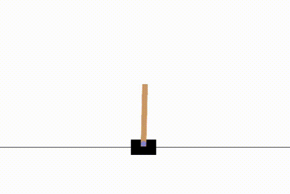
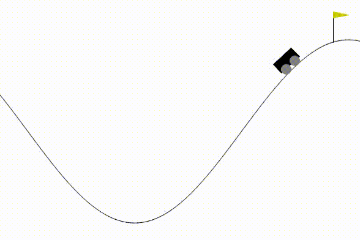
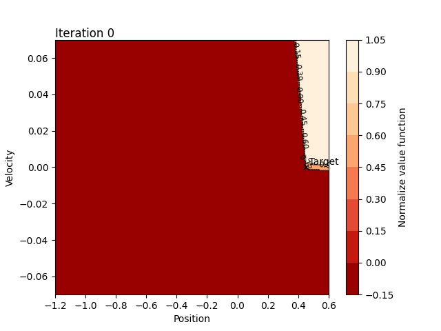

# Policy Iteration for Continuous Dynamics

This repository contains an implementation of **Policy Iteration (PI)** applied to environments with continuous dynamics.  The **Value Function (VF)** is approximated using linear interpolation within each **simplex** of the discretized state space. The interpolation coefficients act like probabilities in a stochastic process, which helps in approximating the continuous dynamics using a discrete **Markov Decision Process (MDP)**. This algorithm it was tested by the environments Cartpole and Mountain car provided by [Gymnasium](https://github.com/Farama-Foundation/Gymnasium).


<p align="center">
   
 
</p>


# Normalize VF vs Number of iterations

The evolution of the value function  for the mountain car as a function of the number of iterations of the algorithm:

<p align="center">
   
 
</p>

# Installation and Setting
- Create Conda environment with dependencies
	``` bash
	conda create --name DynamicProgramming python=3.11 ipykernel
	```
- Activate environment
	``` bash
	conda activate DynamicProgramming
	```
- Install the Policy Iteration class:
	``` bash
	pip install -e .
	```
# Files

 - **src/PolicyIteration.py**: This is the implementation of the policy iteration algorithm, interpolating the value function with the vertices of a simplex.
 - **src/utils/utils.py**: Contains auxiliary functions for testing the environments with the already calculated value function and functions for plotting it.
 - **testing.ipynb**: This is a notebook for testing the algorithm in the cartpole and mountain car environments.

# Simplex in This Project

A simplex is a generalization of the notion of a triangle or tetrahedron to arbitrary dimensions. It is a fundamental building block in computational geometry and is used in various applications, including the interpolation methods used in this project. Here are the key concepts:

- **Vertices**: A simplex is defined by its vertices. For example, a 2-dimensional simplex (a triangle) has 3 vertices, a 3-dimensional simplex (a tetrahedron) has 4 vertices, and so on.

- **Edges**: The line segments connecting pairs of vertices are called edges. A *d-dimensional* simplex has $\frac{d(d+1)}{2}$ edges.

- **Barycentric Coordinates**: Any point inside a simplex can be represented as a weighted sum of its vertices, where the weights (barycentric coordinates) are non-negative and sum to one. These coordinates are useful for interpolation.

- **Linear Interpolation**: Within a simplex, the value of a function at any point can be linearly interpolated from its values at the vertices. This property is leveraged in the Policy Iteration algorithm to approximate the value function over a continuous state space.


In the context of this project, the state space is discretized into a mesh of simplexes (triangles in 2D, tetrahedra in 3D, and higher-dimensional analogs in higher dimensions). The value function is then approximated by linearly interpolating within these simplexes.

- **State Space Discretization**: The continuous state space is divided into smaller regions using simplexes. This allows for a piecewise linear approximation of the VF.
- **Interpolation Process**: For any state $\eta(\xi,u)$ within a simplex, its value is interpolated from the values at the vertices of the simplex. The barycentric coordinates determine the weights for this interpolation.
- **Stochastic Approximation**: This interpolation process can be seen as a probabilistic transition to the vertices of the simplex, allowing the continuous dynamics to be approximated by a discrete Markov Decision Process (MDP).


Considering this approach the dynamic programming equation used to compute the **VF** (eq. 5 in [2]) is given by: :

$$V(\xi) = \max_u \left[ \gamma^{\tau(\xi, u)} \sum_{i=0}^{d} p(\xi_i | \xi, u) V(\xi_i) + R(\xi, u) \right]$$ 

Here:

- $V(\xi)$ is the value function at state $\xi.$
- $\gamma^{\tau(\xi, u)}$ is the discount factor, $\tau(\xi, u)$ is the time taken to transition from state $\xi$ under control $u$.
- $p(\xi_i | \xi, u)$ is the probability of transitioning to state $\xi_i$ from $\xi$ under control $u$.
- $R(\xi, u)$ is the immediate reward received from state $\xi$ under control $u$.


 
# References
- [1] R. Munos and A. Moore, "Barycentric interpolators for continuous space & time reinforcement learning" Robotics Institute, Carnegie Mellon University, Pittsburgh, PA, 1998.

- [2] R. Munos and A. Moore, "Variable resolution discretization in optimal control" Machine Learning, vol. 49, pp. 291–323, 2002.

- [3] Rémis Munos, "A Study of Reinforcement Learning in the Continuous Case by the Means of Viscosity Solutions" Machine Learning, 40, 265–299, 2000.

